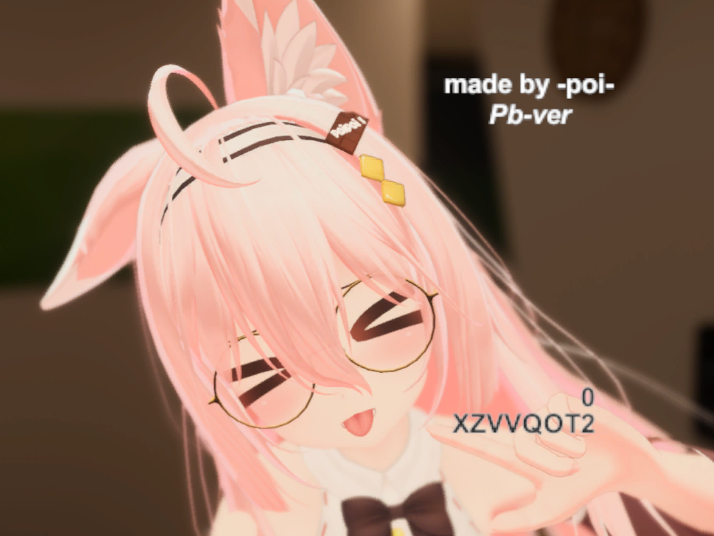
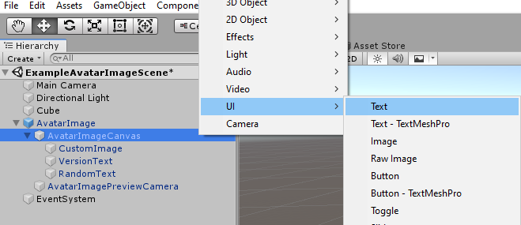

# AvatarImage アバターイメージツール
A simple tool for avatar creators to create a custom image (with random text generator and version marking) for their avatar without any extra works.

アバター作成者がカスタム画像を作成するためのツールです。 画像のバージョン番号とランダムに生成された文字列を自動的に書き込むことができます。

讓你輕鬆建立自已的角色圖像的小工具，能為你的圖像自動寫上版本號碼和隨機產生的字串用作記認之用。




## Language 語言

The tool is currently provided in English only. It will be translated in more languages later.

このツールは現在英語だけで提供されています。

工具現在只提供英文版本。

## Installing/Updating インストール/更新

1. Obtain the Unity package file from the [latest releases](https://github.com/poi-vrc/AvatarImage/releases/latest).

    [最新リリース](https://github.com/poi-vrc/AvatarImage/releases/latest)からUnityパッケージファイルを入手します。

    在[GitHub Releases](https://github.com/poi-vrc/AvatarImage/releases/latest)中下載最新版本的Unity package文件。

2. Make sure the latest VRCSDK2/VRCSDK3 is imported into your project.

    最新のVRCSDK2またはVRCSDK3がプロジェクトにインポートされていることを確認します。

    請確保最新的VRCSDK2/VRCSDK3已經導入了在你的角色專案中。

3. As a precaution, please backup your own project before proceeding.

    進める前に、自分のプロジェクトをバックアップしてください。

    爲防萬一，在開始前，請先備份你自己的角色專案。

4. If you are updating AvatarImage, delete the ```AvatarImage``` folder within the ```Assets/chocopoi``` folder.

    アバターイメージをアップデートする場合は、```Assets/chocopoi```フォルダ内の```AvatarImage```フォルダを削除してください。

    如果在更新AvatarImage，請刪除```Assets/chocopoi```中的```AvatarImage```文件夾。

5. Import the latest ```AvatarImage-x.x.x.unitypackage``` file into your project.

    最新の```AvatarImage-x.x.x.unitypackage```ファイルをプロジェクトにインポートします。
    
    把最新的```AvatarImage-x.x.x.unitypackage```文件導入到您的角色專案中。

6. Drag the ```AvatarImage``` prefab from the ```Assets/chocopoi/AvatarImage``` folder to your avatar scene.

    ```Assets/chocopoi/AvatarImage```フォルダの中の```AvatarImage.prefab```をアバターのシーンにドラッグします。

    將```Assets/chocopoi/AvatarImage```文件夾中的```AvatarImage.prefab```拖到您的場景中。

7. Use the provided interface to customize your settings:

    付属のインターフェイスを使用して、設定をカスタマイズします。

    使用小工具提供的界面更改和個人化角色圖像設定:


## Customization カスタマイゼーション

 

### Adding texts/images/UI elements テキストやイメージやUI要素の追加

> :warning: Do not rename or delete any of the GameObjects that come with the prefab, otherwise it will cause run-time errors. You can disable them from the interface if you do not want them.

> :warning: Prefabに付属するGameObjectの名前を変更したり、削除したりしないでください。そうしないと、ランタイムエラーが発生します。 インターフェイスからディセーブルにできます。 

> :warning: 不要重命名或刪除任何Prefab原有的物件，否則會導致程式錯誤。 如果你不想要它們出現在角色圖像中，你可以從小工具提供的界面中關掉它們。 

AvatarImage creates its image using the Unity built-in UI camera overlay. You can fully customize it as long as you use the UI elements provided by Unity. ```AvatarImageCanvas``` is the root of the UI elements that are being rendered to the image. Just add your wanted texts/images and scale it properly to fit into the canvas.

AvatarImageはUnityに内蔵されたUIを利用してキャラクターのイメージを生成します。```AvatarImageCanvas```に自分の文字とイメージを追加することができます。

AvatarImage利用Unity內置的UI來產生角色圖像，你完全可以在```AvatarImageCanvas```中加自已的文字和圖像。




### Moving the position of the VRCCam before build

If you are not using a custom image to use as your avatar image, you can always act the ```AvatarImagePreviewCamera``` as a ```VRCCam``` and move, rotate and scale it to capture the best spot of your avatar. Make sure you have ticked the ```Move VRCCam to the current AvatarImagePreviewCamera location``` checkbox to make this possible.

カスタムイメージを使用していない場合、いつでも```AvatarImagePreviewCamera```を```VRCCam```のように動作させ、移動、回転、拡大縮小して、アバターの最高の場所の写真を撮る。 インターフェイスに　```Move VRCCam to the current AvatarImagePreviewCamera location```チェックボックスがオンになっていることを確認します。

如果不使用自定義的圖像，隨時可以當```AvatarImagePreviewCamera```是```VRCCam```那樣移動、旋轉、放大縮小。 但請確保在小工具提供的界面中選了```Move VRCCam to the current AvatarImagePreviewCamera location```。

### Scaling custom image properly

AvatarImage supports an image that has a resolution of 1920x1080 or in the aspect ratio 16:9 by default without modification. The image is then rendered into a 400x300 image for VRChat. You can always adjust the ```Rect Transform``` within the ```CustomImage``` GameObject to fit your needs if your image is not in the aspect ratio of 16:9.

AvatarImageは、解像度 1920x1080 またはアスペクト比 16:9 の画像を、何も変更せずにサポートします。 もし君の画像が16:9の割合でなかったら、自分の必要に応じて```CustomImage```の中で```Rect Transform```の位置と拡大縮小を調節することができる。

AvatarImage在沒有修改任何設定的情況下，支持分辨率爲1920x1080或像素比例爲16:9的自定義圖像，自定義圖像將被剪輯成400x300的圖像。 如果你的圖像不是在16:9比例，可以根據自己的需要在```CustomImage```物件中調整```Rect Transform```的位置和放大縮小。

 

## License
[tl;dr](https://tldrlegal.com/license/mit-license) This project is licensed under the MIT License. Copyright (c) 2021 poi-vrc.